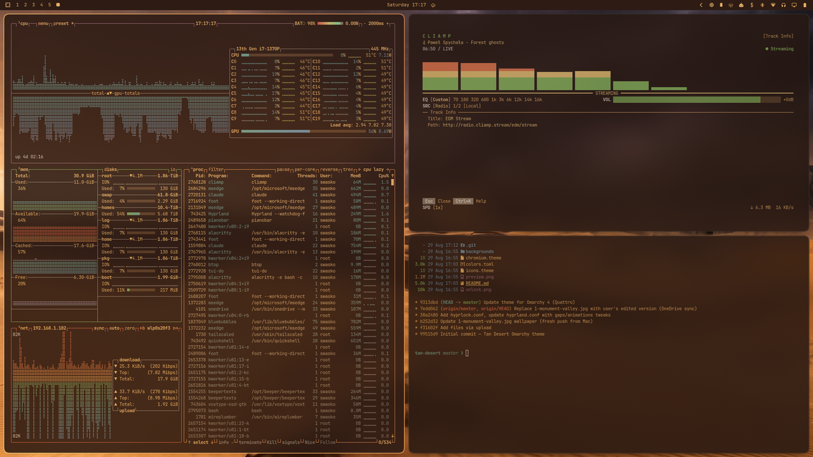

# Tan Desert — an Omarchy theme

[](https://github.com/sponsors/sjwasko)
[](https://buymeacoffee.com/sutibu)

**Retro amber terminal glow · Golden hour desert palette**

A warm, earthy Omarchy theme inspired by the golden-hour desert landscape of
Monument Valley. Terminal text glows in retro amber against a deep tan-brown
backdrop, and Hyprland windows are framed by a sandstone-to-amber gradient.



> Requires **Omarchy 4 (Quattro)** or newer. The whole theme is driven by a
> single `colors.toml`; Omarchy generates every themed config from it.

## Installation

```bash
omarchy theme install git@github.com:sjwasko/omarchy-tan-desert-theme.git
```

That clones the repo into `~/.config/omarchy/themes/tan-desert` and applies it.
To switch back to it later:

```bash
omarchy theme set tan-desert
```

To pull a newer version of this (and every other installed) theme:

```bash
omarchy theme update
```

## Palette

`colors.toml` uses Omarchy 4's semantic palette. Anything not listed here is
derived from these keys.

### Surfaces

| Key | Hex | Description |
|-----|-----|-------------|
| `background` | `#2D1B14` | Deep warm earth — desert canyon shadow |
| `dark_background` | `#1F120D` | Recessed panels |
| `darker_background` | `#150C08` | Deepest canyon shadow |
| `lighter_background` | `#3A2C22` | Raised surface — dark bark |
| `selection` | `#5A3D28` | Selected rows, meters, highlight surfaces |

### Text

| Key | Hex | Description |
|-----|-----|-------------|
| `foreground` | `#E8B065` | Retro amber terminal glow |
| `bright_foreground` | `#EDE0D0` | Sunlit sand |
| `light_foreground` | `#D4C5B0` | Sandy parchment |
| `dark_foreground` | `#A89684` | Weathered driftwood |
| `muted` | `#8B7A6A` | Desert dust — dim/disabled text |

### Accents

| Key | Hex | Description |
|-----|-----|-------------|
| `accent` | `#D4834A` | Burnt orange — sunlit sandstone |
| `red` | `#C75B39` | Terracotta / desert rust |
| `green` | `#7A9A4C` | Sage / palo verde |
| `yellow` | `#D4A050` | Warm amber sunlight |
| `blue` | `#6A8BA0` | Distant mountain haze |
| `magenta` | `#9C6B7A` | Desert dusk lavender |
| `cyan` | `#6B9A8A` | Agave green |
| `orange` | `#D4834A` | Sunlit sandstone |
| `brown` | `#8B5E3C` | Mesa rock |
| `bright_red` | `#E8794D` | Vivid terracotta |
| `bright_green` | `#8DB85C` | Vibrant sage |
| `bright_yellow` | `#F0C674` | **Retro amber glow** |
| `bright_blue` | `#7DA8C0` | Clear desert sky |
| `bright_magenta` | `#B88094` | Desert rose bloom |
| `bright_cyan` | `#88C4B4` | Bright agave |

### Terminal specifics

Text selection is deliberately inverted — an amber block with dark text
(`selection_background` `#E8B065`, `selection_foreground` `#2D1B14`) — so
selections read as a highlighter stroke rather than a dimmed box.

ANSI bright black is `muted` (`#8B7A6A`), light enough that dimmed program
output stays readable against the dark background.

### Window borders

`hyprland_active_border` is a golden-hour gradient:

```toml
hyprland_active_border = "rgba(D4834Aee) rgba(F0C674ee) 45deg"
hyprland_inactive_border = "rgba(3A2C22aa)"
```

Omarchy reuses the active-border gradient for shell notification borders,
popups, menu cards, and the lock-screen input field, so the whole desktop
shares one accent treatment.

## Files

| File | What it configures |
|------|--------------------|
| `colors.toml` | The entire palette — everything else is generated from it |
| `icons.theme` | Icon theme (`Yaru-olive`) |
| `chromium.theme` | Browser frame color |
| `preview.png` | Theme preview shown in the theme switcher |
| `unlock.png` | Lock-screen branding image |
| `backgrounds/` | Wallpapers |

## Notes for Omarchy 3 users

Omarchy 4 generates terminal configs, Hyprland border settings, the Neovim
colorscheme, and the VS Code theme from `colors.toml`, and it will not stage
`*.lua`, terminal configs, or `vscode.json` shipped by a theme installed from a
git repo. Those files have been removed from this theme; the generated versions
use the same palette.

Two things that used to live in this theme are now yours to set, because they
are personal preferences rather than colors:

**Terminal transparency** (previously 82% in each terminal config) —
in `~/.config/alacritty/alacritty.toml`:

```toml
[window]
opacity = 0.82
```

**Window opacity, gaps, blur, and shadows** (previously in `hyprland.conf`) —
in `~/.config/hypr/looknfeel.lua`:

```lua
hl.config({
  general = { border_size = 2, gaps_in = 2, gaps_out = 2 },
  decoration = {
    active_opacity = 0.92,
    inactive_opacity = 0.88,
    rounding = 6,
    blur = { enabled = true, size = 6, passes = 3 },
    shadow = { enabled = true, range = 20, render_power = 3, color = "rgba(2D1B14CC)" },
  },
})
```

## Inspiration

Based on a photograph of desert buttes at golden hour — warm orange sandstone,
purple-cool shadows in the crevices, distant mountain haze, and the
unmistakable amber quality of light just before sunset.

## License

MIT — use it, share it, remix it.
